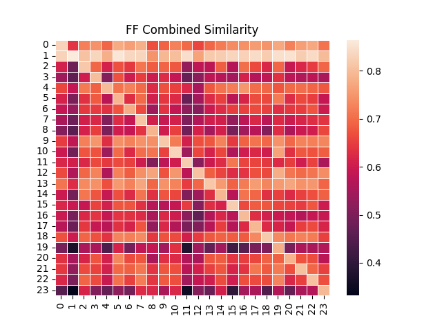

# Fake Profile Detection on Social Media Platforms 🛡️

Detecting fake profiles using keystroke dynamics.

---

## 🎯 Project Goal

Develop a lightweight system to identify fake profiles on social media platforms using keystroke features.

---

## 🔍 Overview of the Key Parts of the Code Base


### 1. Features

- Word level features are extracted from the `features/word_parser` file.
- Keystroke features (KHT & KIT) are extracted from the `features/keystroke_features` file.

### 2. Verifiers

- **Template Generator**: Processes our compact CSV file containing keystroke data.
- **Verifier Library**: A set of verifier algorithms implemented as class methods for easy usage. These include:
  - Absolute Verifier
  - Similarity Verifier
  - ITAD

### 3. Fusion

- **Score Level Fusion**: Features several fusion algorithms:
  - Mean
  - Median
  - Min
  - Max

  Fusion scores are derived by iterating over the ITAD, Absolute, and Similarity matrices. These scores are then employed to determine the `top_k_accuracy_score` ranging from k=1 to k=5.

- **Decision Level Fusion**: Fusion at the score level is determined using empirically set thresholds specific to each verifier. Profiles are labeled genuine or otherwise based on the outcome.

### 4. Heatmap Generation

Generates a heatmap using a matrix of the scores from a particular verifier algorithm for all user IDs. The scores are derived from keystroke features and, optionally, word-level features.

For example, this is an example heatmap with probe and enrollment IDs
both for Facebook , combining KHT and KIT Flight 1 features, using all available session IDs, and the similarity verifier as the algorithm:


### 5. Configuration File

Configure experimental conditions via the config file:

- `use_feature_selection`: Opt for feature selection with **true** or skip with **false**.
- `use_word_holder`: Decide to use word level features with **true** or avoid with **false**.
- `gender`: Choose the gender data to incorporate:
  - **all**: All IDs
  - **male**: Male IDs only
  - **other**: Other IDs only

## 🚀 Getting Started

### Prerequisites

All of the runnable scripts are in the repository root or in the plots directory
To install dependencies, simply run:

```sh
pip3 install -r requirements.txt
```

Now you are ready to go and can run any of the runnable scripts
