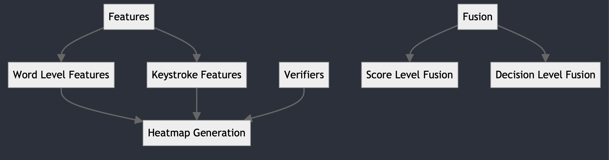

# Fake profile detection on social media platforms

## Running the code

All of the runnable scripts are in the repository root or in the plots directory
To install dependencies, simply run:

```sh
pip3 install -r requirements.txt
```

Now you are ready to go and can run any of the runnable scripts

## Overview of the key parts of the code base

### Features

The functions to extract features are in the features/word_parser file for word level features amd in the features/keystroke_features file for KHT amd KIT features

### Verifiers

Template Generator: helpers to process our compact csv file of keystroke data
Verifier Library: verifier algorithms implemented as class methods for ease of use

### Fusion

Score Level Fusion: We implement several score level fusion algorithms

- Mean
- Median
- Min
- Max

The fusion matrix is calculated by iterating each triplet of the ITAD, Absolute, and Similarity matrices and applying the fusion algorithm to chose a final score. This matrix of fusion scores is used as input to calculate the top_k_accuracy_score from k=1 to k=5

Decision Level Fusion: We calculate score level fusion by using empirically determined thresholds for the particular verifier. If the score meets or exceeds the threshold, the profile is considered Genuine and we return False, otherwise we return True. Using the number of occurrences of False and True, if count(False) is greater than count(True), we say that the profile is genuine. If the probe id, matches the enrollment id, we also say that the profile is genuine. If both our verdict and the actual designation match we consider that a correct classification.

### Heatmap Generation

A heatmap is generated by creating a matrix of the scores for a particular verifier algorithm across all user IDs using the keystroke features and, optionally, the word level features

### The config file

The config file is a way to control some of the conditions used while running experiments

1. `use_feature_selection`
Determines if feature selection should be applied.
    - **true**: Apply feature selection.
    - **false**: Do not apply feature selection.

2. `use_word_holder`
Determines if word level features should be used, along with KHT/KIT features.
    - **true**: Use a word level features.
    - **false**: Do not use them.

3. `gender`
Specifies which gender data to include (we store a mapping in the code of what gender each ID was).
    - **all**: Include all ids.
    - **male**: Include all male ids.
    - **other**: Include all other ids. 


